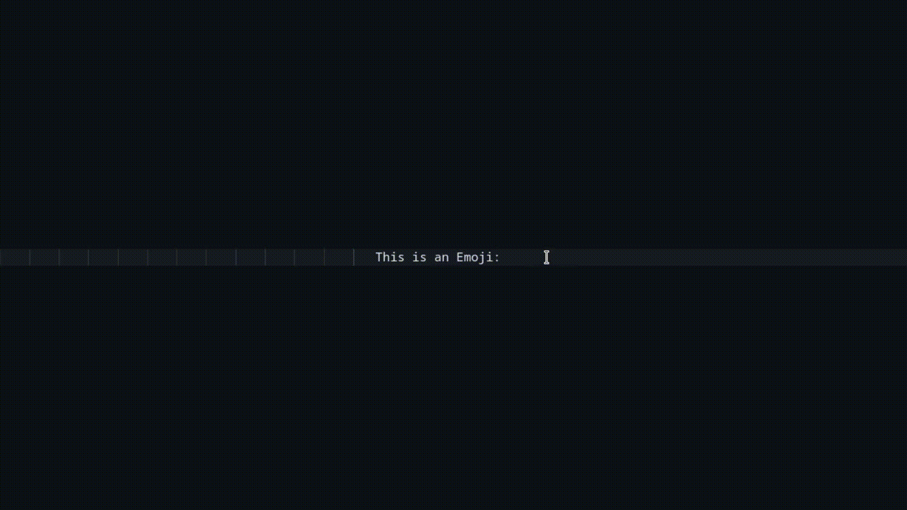

# Rofi Emoji Picker
A simple Rofi script for picking emojis.

## Requirements

- [rofi](https://github.com/davatorium/rofi])
- [xclip](https://github.com/astrand/xclip) or [wl-copy](https://github.com/bugaevc/wl-clipboard) 
- [jq](https://jqlang.github.io/jq/)
- [awk](https://github.com/onetrueawk/awk)

## Setup
- `git clone https://github.com/Rizwan-V-Kandy/Rofi-Emoji-Picker`

- `cd Rofi-Emoji-Picker/Rofi`

## Usage
- Enter the name of your desired emoji into the search bar, select it, and press Enter. After doing so, the emoji will be copied to your clipboard, allowing you to paste it.

- Choose the appropriate command based on your display server:

    ### For X11
    - `./Emoji-Selector.sh --x11`
    ### For Wayland
    - `./Emoji-Selector.sh --wayland`

# Credits
This project uses Emoji JSON from https://github.com/amio/emoji.json.